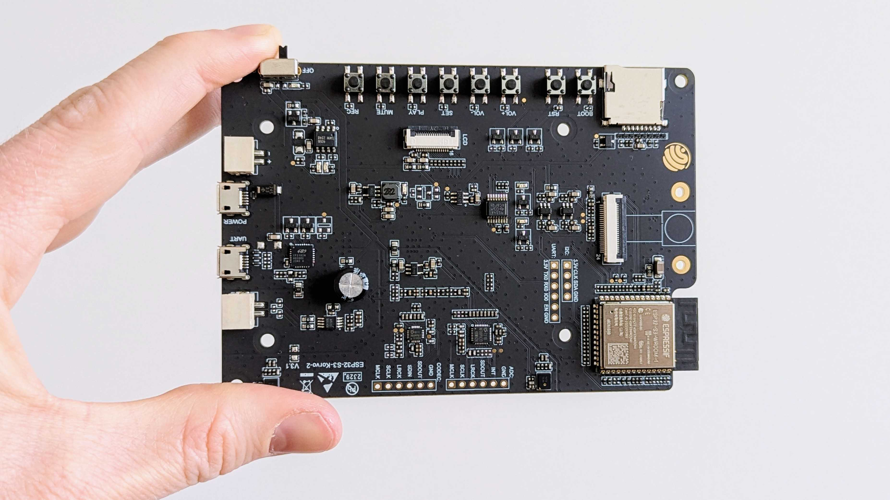

The goal of the bioacoustics on tiny hardware task is to develop an automatic classifier of birdsong that complies with the resource constraints of low-cost and battery-powered autonomous recording units.

# Description

The next generation of autonomous recording units contains programmable chips, thus offering the opportunity to perform BioDCASE tasks. On-device processing has multiple advantages, such as high durability, low latency, and privacy preservation. However, such "tiny hardware" is limited in terms of memory and compute, which calls for the development of original methods in audio content analysis.

In this context, task participants will revisit the well-known problem of automatic detection of birdsong while adjusting their systems to meet the specifications of a commercially available microcontroller. The challenge focuses specifically on the detection of Yellowhammer bird vocalizations using the ESP32-S3-Korvo-2 development board.


Figure 1: ESP32-S3-Korvo-2 development board


The primary challenge is striking the optimal balance between classification accuracy and resource usage. While conventional deep learning approaches might achieve high accuracy, they may not be feasible on embedded hardware. Participants must explore techniques such efficient architecture design, and optimized feature extraction to create a solution that performs well within the hardware constraints.

A baseline implementation is provided as a starting point, which participants can modify and improve upon. Solutions will be evaluated based on classification performance, model size, inference time, and memory usage.

**Note:** We encourage participants to buy the ESP32-S3-Korvo-2 development board to test their solutions. The board is available for purchase on various online platforms (e.g, at [DigiKey](https://www.digikey.de/de/products/detail/espressif-systems/ESP32-S3-KORVO-2/15822448)). However, the competition can be completed without the board, as the evaluation will be performed on a hidden test set using the baseline system by the organizers.

# Dataset

The BioDCASE-Tiny 2025 competition uses a specialized dataset of Yellowhammer bird vocalizations. Key features include:

- 2+ hours of audio recordings
- Songs from multiple individuals recorded at various distances (6.5m to 200m)
- Recordings in different environments (forest and grassland)
- Includes negative samples (other bird species and background noise)
- Dataset split into training, validation, and evaluation sets

The training set contains recordings from 8 individuals, while the validation set contains recordings from 2 individuals. An additional 2 individuals are reserved for the final evaluation.

The dataset is organized as follows:

```
Development_Set/
├── Training_Set/
│   ├── Yellowhammer/
│   │   └── *.wav (Yellowhammer vocalizations)
│   └── Negatives/
│       └── *.wav (Other species and background noise)
└── Validation_Set/
    ├── Yellowhammer/
    │   └── *.wav (Yellowhammer vocalizations)
    └── Negatives/
        └── *.wav (Other species and background noise)
```

* Files under `Yellowhammer/` contain Yellowhammer vocalization (target species for detection)
* Files under `Negatives/` contain negatives samples which include vocalization from other species, as well as background noise recordings extracted for the full recordings.

The dataset is available for download on Zenodo: [BioDCASE-Tiny 2025 Dataset](https://doi.org/10.5281/zenodo.15228365)

# Evaluation and Baseline System

We provide a baseline system that includes a complete pipeline for audio processing, feature extraction, model training, and deployment to the ESP32-S3-Korvo-2 development board. The baseline system is designed to be easily adaptable for participants to build upon.

You can find the baseline system in the GitHub repository: [BioDCASE-Tiny 2025 Baseline System](https://github.com/birdnet-team/BioDCASE-Tiny-2025)

Submissions will be evaluated based on both classification performance and resource efficiency:

### Classification Performance
- **Average precision**: The average value of precision across all recall levels from 0 to 1.

### Resource Efficiency (measured on the ESP32-S3-Korvo-2 development board)
- **Model Size**: TFLite model file size (KB)
- **Inference Time**: Average time required for single audio classification, including feature extraction (ms)
- **Peak Memory Usage**: Maximum RAM usage during inference (KB)

### Ranking
Participants will be ranked separately for each one of the evaluation criteria.

A baseline system is provided in the GitHub repository, including a complete pipeline for audio processing, feature extraction, model training, and deployment to the ESP32-S3-Korvo-2 development board.

# External Data Resources

The competition focuses on the provided Yellowhammer dataset. External data use may be regulated according to the [official competition rules](https://biodcase.github.io/challenge2025/rules)

# Task Rules

1. Solutions must be deployable on the ESP32-S3-Korvo-2 development board
2. Models must process audio from the onboard microphone array in real-time
3. Submissions must include .h5 model files and pipeline_config.yaml in a zip file
4. Solutions will be evaluated on a hidden test set using the baseline system
5. Participants must cite the competition framework and dataset in any publications

# Citation

If you use the BioDCASE-Tiny framework or dataset in your research, please cite the following:

### Framework Citation

```bibtex
@misc{biodcase_tiny_2025,
  author = {Carmantini, Giovanni and Förstner, Friedrich and Isik, Can and Kahl, Stefan},
  title = {BioDCASE-Tiny 2025: A Framework for Bird Species Recognition on Resource-Constrained Hardware},
  year = {2025},
  institution = {Cornell University and Chemnitz University of Technology},
  type = {Software},
  publisher = {GitHub},
  journal = {GitHub Repository},
  howpublished = {\url{https://github.com/birdnet-team/BioDCASE-Tiny-2025}}
}
```

### Dataset Citation

```bibtex
@dataset{yellowhammer_dataset_2025,
  author = {Morandi, Ilaria and Linhart, Pavel and Kwak, Minkyung and Petrusková, Tereza},
  title = {BioDCASE 2025 Task 3: Bioacoustics for Tiny Hardware},
  year = {2025},
  publisher = {Zenodo},
  doi = {10.5281/zenodo.15228365},
  url = {https://doi.org/10.5281/zenodo.15228365}
}
```

# Support

If you have questions please use the [BioDCASE Google Groups community forum](https://groups.google.com/g/biodcase-community), or contact the task organizers at: [stefan.kahl@cornell.edu](mailto:stefan.kahl@cornell.edu)